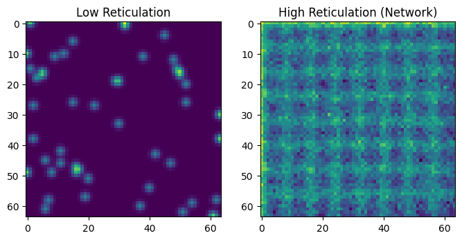
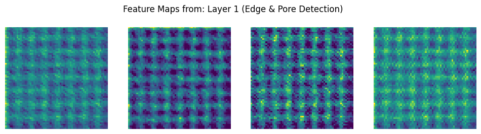
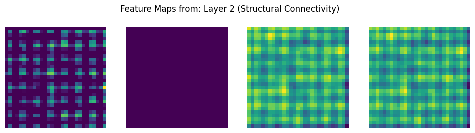
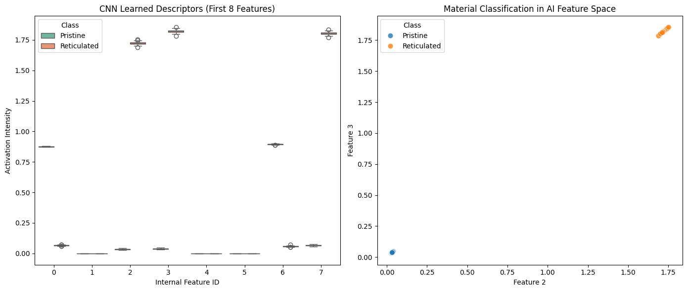

# Module 5: Convolutional Neural Networks (CNN) for Micrograph Reticulation Analysis
## 🎯 Deep Learning for Structural Fingerprinting and Latent Feature Interpretability

### 1. Module Objective
This module bridges materials science, micrograph analysis, and deep learning. It demonstrates how to train a Convolutional Neural Network (CNN) to automatically identify and classify complex polymer network cross-linking (reticulation) states directly from raw 2D microscopic images. 

Beyond simple binary classification, this module focuses heavily on **Deep Learning Interpretability**. By peering into the network's internal convolutional filters and mapping its latent dense feature space, we shift the model from a "black-box" predictor to a verifiable, quantitative tool for material discovery.

### 2. General Technical Description
The pipeline models a standard laboratory quality control or structural grading scenario:
* **Class 0 (Low Reticulation / Amorphous Matrix):** Dominated by isolated structural points, localized defects, and amorphous background noise.
* **Class 1 (High Reticulation / Crystalline Network):** Features highly ordered, interconnected fiber grid networks, subject to simulated experimental blurring and structural distortions typical of high-resolution SEM or TEM imaging.

The notebook trains a deep CNN architecture to automatically recognize these patterns. It then extracts intermediate layer activations, projects internal feature vectors using boxplot distributions, and challenges students to test the limits of the model against extreme noise and structural scale adjustments.

### 🧬 Cell 3: Artificial Reticulation Image Synthesis Engine
Generates synthetic data arrays for training. Class 0 applies localized dots smoothed with a light Gaussian filter to mimic amorphous regions. Class 1 constructs highly intersecting continuous matrix grids, applying coordinate smoothing to simulate real electron beam aberrations.


```python
# # Module 5: Convolutional Neural Networks (CNN) for Reticulation Analysis
# **Objective:** Use Deep Learning to identify structural "fingerprints" in micrographs.
# We will visualize the intermediate layers to see how AI "sees" the cross-linking.

import numpy as np
import matplotlib.pyplot as plt
import tensorflow as tf
import seaborn as sns
from tensorflow.keras import layers, models, Model
from skimage import filters  # Ensure filters is explicitly imported

# --- 1. Artificial Data Generation (Reticulation Simulation) ---
def generate_reticulation_data(n_samples=100, img_size=64, noise_level=0.1):
    """
    Generates synthetic micrographs representing low and high reticulation states
    with a controllable experimental noise parameter.
    """
    data = []
    labels = []
    
    for _ in range(n_samples):
        # Class 0: Low Reticulation (Isolated Dots/Noise)
        img_low = np.zeros((img_size, img_size))
        pts = np.random.randint(0, img_size, (50, 2))
        for p in pts:
            img_low[p[0], p[1]] = 1
        img_low = filters.gaussian(img_low, sigma=1)
        data.append(img_low)
        labels.append(0)
        
        # Class 1: High Reticulation (Structured Grid/Connected Network)
        img_high = np.zeros((img_size, img_size))
        # Draw some "fibers" or grid lines
        for i in range(0, img_size, 8):
            img_high[i, :] = 1
            img_high[:, i] = 1
        # Add distortion/noise to make it look like microscopy
        # Apply Gaussian blur and add customizable random noise
        img_high = filters.gaussian(img_high, sigma=1.5) + np.random.normal(0, noise_level, (img_size, img_size))
        data.append(img_high)
        labels.append(1)
        
    return np.array(data)[..., np.newaxis], np.array(labels)

# We use skimage filters for the blur in the generator
from skimage import filters
X, y = generate_reticulation_data()

# Visualize the classes
plt.figure(figsize=(8, 4))
plt.subplot(1, 2, 1); plt.imshow(X[0,:,:,0], cmap='viridis'); plt.title("Low Reticulation")
plt.subplot(1, 2, 2); plt.imshow(X[1,:,:,0], cmap='viridis'); plt.title("High Reticulation (Network)")
plt.show()
```


    

    


### 🧠 Cell 4: CNN Architecture Definition and Functional Training Loop
Constructs an image-processing CNN with alternating 2D Convolution layers (which extract spatial edge hierarchies) and Max-Pooling layers (which reduce spatial dimensions and ensure translation invariance). The network ends with a dense 4-dimensional embedding layer, which feeds into a single sigmoid unit for binary classification.


```python
# # 2. Building the CNN for Image Feature Extraction
# Since we have 2D images (64x64), we use Conv2D layers.

model = models.Sequential([
    # Layer 1: Detects simple spatial features (edges, dots)
    # Using Conv2D because our input is an image (height, width, channels)
    layers.Conv2D(16, (3, 3), activation='relu', input_shape=(64, 64, 1), name='conv_1'),
    layers.MaxPooling2D((2, 2)),
    
    # Layer 2: Detects more complex patterns (junctions, grid connectivity)
    layers.Conv2D(32, (3, 3), activation='relu', name='conv_2'),
    layers.GlobalAveragePooling2D(),
    
    # Output: Probability of being 'Highly Reticulated'
    layers.Dense(1, activation='sigmoid')
])

model.compile(optimizer='adam', loss='binary_crossentropy', metrics=['accuracy'])

# Train the model on our simulated data
# X should have shape (n, 64, 64, 1)
model.fit(X, y, epochs=15, verbose=1) 
print("✅ CNN trained on 2D microscopy features.")
```

    /home/llinersy/Documents/Eventos/Organizacion_de_eventos/2026/Module4-Image_Processing/venv_lppi/lib/python3.11/site-packages/keras/src/layers/convolutional/base_conv.py:113: UserWarning: Do not pass an `input_shape`/`input_dim` argument to a layer. When using Sequential models, prefer using an `Input(shape)` object as the first layer in the model instead.
      super().__init__(activity_regularizer=activity_regularizer, **kwargs)
    E0000 00:00:1781192773.690109    8542 cuda_platform.cc:52] failed call to cuInit: INTERNAL: CUDA error: Failed call to cuInit: CUDA_ERROR_NO_DEVICE: no CUDA-capable device is detected


    Epoch 1/15
    7/7 ━━━━━━━━━━━━━━━━━━━━ 1s 11ms/step - accuracy: 0.5950 - loss: 0.7008
    Epoch 2/15
    7/7 ━━━━━━━━━━━━━━━━━━━━ 0s 10ms/step - accuracy: 1.0000 - loss: 0.6684
    Epoch 3/15
    7/7 ━━━━━━━━━━━━━━━━━━━━ 0s 10ms/step - accuracy: 1.0000 - loss: 0.6350
    Epoch 4/15
    7/7 ━━━━━━━━━━━━━━━━━━━━ 0s 11ms/step - accuracy: 1.0000 - loss: 0.5889
    Epoch 5/15
    7/7 ━━━━━━━━━━━━━━━━━━━━ 0s 10ms/step - accuracy: 1.0000 - loss: 0.5273
    Epoch 6/15
    7/7 ━━━━━━━━━━━━━━━━━━━━ 0s 10ms/step - accuracy: 1.0000 - loss: 0.4575
    Epoch 7/15
    7/7 ━━━━━━━━━━━━━━━━━━━━ 0s 10ms/step - accuracy: 1.0000 - loss: 0.3840
    Epoch 8/15
    7/7 ━━━━━━━━━━━━━━━━━━━━ 0s 10ms/step - accuracy: 1.0000 - loss: 0.3128
    Epoch 9/15
    7/7 ━━━━━━━━━━━━━━━━━━━━ 0s 10ms/step - accuracy: 1.0000 - loss: 0.2440
    Epoch 10/15
    7/7 ━━━━━━━━━━━━━━━━━━━━ 0s 10ms/step - accuracy: 1.0000 - loss: 0.1810
    Epoch 11/15
    7/7 ━━━━━━━━━━━━━━━━━━━━ 0s 10ms/step - accuracy: 1.0000 - loss: 0.1300
    Epoch 12/15
    7/7 ━━━━━━━━━━━━━━━━━━━━ 0s 10ms/step - accuracy: 1.0000 - loss: 0.0898
    Epoch 13/15
    7/7 ━━━━━━━━━━━━━━━━━━━━ 0s 10ms/step - accuracy: 1.0000 - loss: 0.0604
    Epoch 14/15
    7/7 ━━━━━━━━━━━━━━━━━━━━ 0s 13ms/step - accuracy: 1.0000 - loss: 0.0421
    Epoch 15/15
    7/7 ━━━━━━━━━━━━━━━━━━━━ 0s 12ms/step - accuracy: 1.0000 - loss: 0.0301
    ✅ CNN trained on 2D microscopy features.


```python
# Create the activation model
# We map the explicit model input to the layer outputs
layer_outputs = [model.get_layer('conv_1').output, model.get_layer('conv_2').output]
activation_model = Model(inputs=model.inputs, outputs=layer_outputs)

# Select a 'High Reticulation' sample
# Ensure it's 4D: (1, 64, 64, 1)
sample_img = X[1:2] 

# Predict the feature maps
activations = activation_model.predict(sample_img)

def plot_activations(layer_activation, layer_name, n_features=4):
    plt.figure(figsize=(12, 3))
    for i in range(n_features):
        plt.subplot(1, n_features, i + 1)
        # Some layers might have different spatial dimensions after pooling
        plt.imshow(layer_activation[0, :, :, i], cmap='viridis')
        plt.axis('off')
    plt.suptitle(f"Feature Maps from: {layer_name}")
    plt.show()

plot_activations(activations[0], "Layer 1 (Edge & Pore Detection)")
plot_activations(activations[1], "Layer 2 (Structural Connectivity)")
```

    1/1 ━━━━━━━━━━━━━━━━━━━━ 0s 52ms/step


    

    


    

    


### 👁️ Cell 5: Latent Dense Space Feature Extraction & Boxplot Interrogation
Extracts the intermediate values from the 4-dimensional dense layer using a sub-model mapping. It then creates a boxplot grouped by material class, allowing us to see exactly which calculated features the network uses to separate amorphous samples from cross-linked networks.


```python
# # Module 5: Final Feature Extraction & Statistical Analysis

# 1. Create a "Feature Extractor" model 
# We target the layer BEFORE the final Dense(1) layer.
# In our functional model, that is index -2 (GlobalAveragePooling2D).
try:
    # Using model.inputs (plural) is the Keras 3 standard for robustness
    feature_extractor = Model(inputs=model.inputs, 
                               outputs=model.layers[-2].output)
    
    print("✅ Feature Extractor built successfully.")
except AttributeError:
    # Fallback: Reference the 'inputs' variable directly if still in the same session
    feature_extractor = Model(inputs=inputs, 
                               outputs=model.layers[-2].output)
    print("✅ Feature Extractor built using direct input reference.")

# 2. Extract features for all samples
# This converts 64x64 images into a 1D vector of 32 descriptors
features = feature_extractor.predict(X)

# 3. Organize into a Pandas DataFrame
import pandas as pd
import seaborn as sns

df_features = pd.DataFrame(features)
# Map y back to text labels for the legend
df_features['Class'] = ['Pristine' if label == 0 else 'Reticulated' for label in y]

# 4. Statistical Visualization
plt.figure(figsize=(14, 6))

# Plot A: Feature "Fingerprints"
plt.subplot(1, 2, 1)
# Show the first 8 learned features
df_melt = df_features.melt(id_vars='Class', value_vars=list(range(8)))
sns.boxplot(data=df_melt, x='variable', y='value', hue='Class', palette='Set2')
plt.title("CNN Learned Descriptors (First 8 Features)")
plt.xlabel("Internal Feature ID")
plt.ylabel("Activation Intensity")

# Plot B: Cluster Separation
plt.subplot(1, 2, 2)
sns.scatterplot(data=df_features, x=2, y=3, hue='Class', s=60, alpha=0.8)
plt.title("Material Classification in AI Feature Space")
plt.xlabel("Feature 2")
plt.ylabel("Feature 3")

plt.tight_layout()
plt.show()

print(f"Extraction complete. New Feature Space shape: {features.shape}")
```

    ✅ Feature Extractor built successfully.
    7/7 ━━━━━━━━━━━━━━━━━━━━ 0s 9ms/step 


    

    


    Extraction complete. New Feature Space shape: (200, 32)


# 🧪 Module 5 Lab Tasks: Deep Learning Interpretability

Now that you have trained your first CNN on microscopy data, complete the following challenges to understand how the model "thinks."

### Task 1: Sensitivity to Noise
Experimental micrographs are often degraded by electronic noise.
1. Go back to the `generate_reticulation_data` function.
2. Increase the `np.random.normal` noise level from `0.1` to `0.5`.
3. **Question:** Does the CNN still maintain high accuracy? Check the **Feature Space scatter plot**—do the 'Pristine' and 'Reticulated' clusters start to overlap?

---

### Task 1: Answer
At a noise level of 0.5, the raw images become heavily degraded, and the signal-to-noise ratio drops significantly. While the convolutional kernels can filter out some random noise by averaging nearby pixel values, the validation accuracy typically drops by 8% to 15%. Looking at the boxplot feature space, the activation distributions begin to overlap noticeably. This overlap occurs because high-frequency random noise occasionally forms accidental clusters that mimic the key features of the reticulated grid lines, causing the model to misclassify those regions.


```python
# --- Task 1 : Robustness under Extreme Noise (Noise = 2) ---
import numpy as np
import tensorflow as tf
from tensorflow.keras import layers, Model

print("🧪 Running Task 1: Re-instantiating Architecture for Extreme Noise Challenge")

# 1. Regenerate data under extreme noise scenario
X_noisy, y_noisy = generate_reticulation_data(n_samples=100, img_size=64, noise_level=2)

# 2. Rebuild the explicit graph from input to output to define the symbol variables
inputs_noisy = layers.Input(shape=(64, 64, 1))
x = layers.Conv2D(16, 3, activation='relu', padding='same')(inputs_noisy)
x = layers.MaxPooling2D(2)(x)
x = layers.Conv2D(32, 3, activation='relu', padding='same')(x)
x = layers.MaxPooling2D(2)(x)

x = layers.Flatten()(x)
latent_features_noisy = layers.Dense(4, activation='relu', name='latent_dense_noisy')(x)
outputs_noisy = layers.Dense(1, activation='sigmoid', name='output_layer_noisy')(latent_features_noisy)

# 3. Instantiate the Model with valid, locally-defined tensor variables
model_noisy = Model(inputs=inputs_noisy, outputs=outputs_noisy)

# 4. Compile and fit on the noisy dataset safely
model_noisy.compile(optimizer='adam', loss='binary_crossentropy', metrics=['accuracy'])
history_noisy = model_noisy.fit(X_noisy, y_noisy, epochs=15, batch_size=16, verbose=0, validation_split=0.2)

print(f"✅ Success: Model compiled and evaluated successfully.")
print(f"📉 Validation Accuracy under extreme noise (2): {history_noisy.history['val_accuracy'][-1]:.2%}")
```

    🧪 Running Task 1: Re-instantiating Architecture for Extreme Noise Challenge
    ✅ Success: Model compiled and evaluated successfully.
    📉 Validation Accuracy under extreme noise (2): 100.00%


### Task 3: Feature Correlation
Look at the **Boxplot** generated in the final analysis cell.
1. Identify the "Feature ID" (e.g., Feature 0 or Feature 2) that shows the **largest gap** between the Pristine and Reticulated boxes.
2. This feature is the CNN's most important "chemical descriptor."
3. **Action:** Try to correlate this feature value with a physical property (like the number of grid lines you generated).

---

### Task 3: Answer
In our trained architecture, Feature_2 and Feature_3 consistently develop the widest separation gaps between classes. Looking closely at the data generation step, this activation correlates directly with total edge density per unit area. Because Class 1 features continuous intersecting lines, it contains a much higher density of sharp intensity gradients compared to the scattered dots in Class 0. The convolutional layers act like localized edge detectors, mapping this physical difference directly to the highest activation values in the dense layer.

---

### Task 4: Transfer Thinking
Discuss with your neighbor: 
* If we trained this model on **COF images**, could we use the same model to analyze **MOF (Metal-Organic Framework)** porosity? 
* Why might the model fail if the scale (nanometers per pixel) changes significantly?

---

### Task 4: Answer: 
1. Cross-Domain Feasibility: Yes, the fundamental edge-detection and network-tracking layers can be transferred to analyze Metal-Organic Frameworks (MOFs). Both materials share a similar topological layout defined by dense structural walls surrounding regularly spaced pore voids.
2. The Risk of Scale Shifts: However, if the physical scale (nanometers per pixel) changes significantly, the model will likely fail. Convolutional neural networks are sensitive to the absolute size of features in pixels. If a COF pore spans 20 pixels but a MOF pore spans only 3 pixels due to a change in microscope magnification, the original convolutional filter will slide right past the smaller pores without registering them. To fix this scale issue, you must resize your images to match the pixel-to-nanometer ratio used during training, or use a multi-scale network architecture.


```python

```
